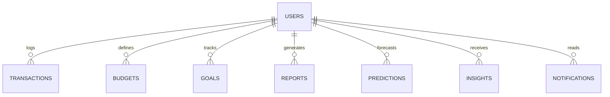

# 💰 AI-Powered Personal Finance Analytics Platform
## Product Requirements Document (PRD), Technical Architecture & Deployment Guide

---

# 📌 Project Overview

The AI-Powered Personal Finance Analytics Platform is a modern fintech application designed to help users manage, analyze, and optimize their personal finances using Data Analytics, Machine Learning, and Artificial Intelligence.

Unlike traditional expense trackers, this platform provides:

- Intelligent financial insights
- Spending behavior analysis
- Predictive expense forecasting
- Financial health scoring
- Budget optimization recommendations
- Interactive analytics dashboards
- Automated report generation

The project serves as a complete Data Analytics and Full-Stack Development portfolio project demonstrating:

- Python
- Flask
- React.js
- SQL
- Pandas
- Scikit-Learn
- Machine Learning
- Data Visualization
- REST API Development
- Cloud Deployment

---

# 🎯 Product Vision

Transform a traditional Personal Finance Management application into an intelligent financial assistant capable of:

- Tracking financial activities
- Identifying spending patterns
- Forecasting future expenses
- Recommending optimized budgets
- Monitoring savings goals
- Generating actionable financial insights

---

# 🚀 Core Features

## 1. Interactive Analytics Dashboard

Real-time KPI monitoring:

- Total Income
- Total Expenses
- Net Savings
- Financial Health Score

Includes:

- Trend Charts
- Spending Distribution
- Budget Utilization
- Goal Tracking

---

## 2. Advanced Analytics Engine

Built using Pandas.

Provides:

- Monthly spending trends
- Category-wise analysis
- Budget performance metrics
- Savings rate calculations
- Spending anomaly detection

---

## 3. Machine Learning Forecasting

Scikit-Learn powered prediction system.

Capabilities:

### Expense Forecasting
Predicts future monthly expenses using historical transaction data.

### Savings Prediction
Estimates future savings growth and goal completion timelines.

### Smart Budget Recommendations
Suggests category-wise budgets based on historical patterns.

---

## 4. AI Insights Engine

Generates human-readable financial recommendations.

Example outputs:

> Food spending increased by 15% compared to last month.

> Entertainment spending decreased by 8%.

> Savings rate improved by 20%.

---

## 5. Financial Report Generation

Export formats:

- PDF
- CSV
- Excel

Includes:

- Financial summaries
- Charts
- KPIs
- AI recommendations

---

## 6. Portfolio Showcase Features

### Financial Health Score
Custom algorithmic score (0-100)

### Expense Heatmap
GitHub-style spending visualization

### Savings Goal Tracker
Progress tracking toward financial goals

### Investment Allocation Tracker
Portfolio allocation monitoring

---

# 👤 User Stories

## US-1: Authentication

As a user,

I want secure registration and login functionality

so that my financial information remains private.

---

## US-2: Transaction Management

As a user,

I want to add, edit, categorize, and delete transactions

so that my financial records stay accurate.

---

## US-3: Dashboard Analytics

As a user,

I want visual charts and KPIs

so that I can understand my financial behavior quickly.

---

## US-4: AI Recommendations

As a user,

I want personalized financial insights

so that I can improve my spending habits.

---

## US-5: Budget Suggestions

As a user,

I want intelligent budget recommendations

so that I can save more effectively.

---

## US-6: Forecasting

As a user,

I want future expense predictions

so that I can plan ahead.

---

## US-7: Report Exports

As a user,

I want downloadable reports

so that I can analyze my finances offline.

---

## US-8: Financial Health Monitoring

As a user,

I want a financial score and heatmap

so that I can track my progress consistently.

---

# 🖥 Dashboard Architecture

## Sidebar Navigation

- Dashboard
- Transactions
- Budgets
- Goals
- Investments
- Reports
- Logout

---

## Header Section

- Search Bar
- Notifications
- User Profile

---

## KPI Cards

### Total Income
Displays monthly earnings.

### Total Expenses
Displays monthly spending.

### Net Savings
Displays income minus expenses.

### Financial Health Score
Displays overall financial wellness score.

---

## Analytics Components

### Line Chart
Income vs Expense Trend

### Bar Chart
Budget vs Actual Spending

### Pie Chart
Category-wise Expense Distribution

### AI Insights Panel
Personalized recommendations

### Expense Heatmap
365-day spending activity tracker

### Goal Progress Cards
Savings goal completion status

---

# 📊 Analytics Engine Design

## Monthly Expense Trend

Tracks spending over time.

---

## Category Breakdown

Computes category-wise spending percentages.

---

## Budget Utilization

Formula:

Spent ÷ Budget × 100

Example:

Budget = ₹10,000

Spent = ₹7,500

Utilization = 75%

---

## Savings Rate

Formula:

(Income − Expense) ÷ Income × 100

Example:

Income = ₹50,000

Expense = ₹35,000

Savings Rate = 30%

---

## Additional Metrics

- Average Monthly Spending
- Maximum Spending Spike
- Top Expense Categories
- Savings Growth Rate

---

# 🤖 Machine Learning Module

## Technologies

- Scikit-Learn
- Pandas
- NumPy

---

## Expense Prediction

Models:

- Linear Regression
- Random Forest Regressor

Output:

- Next Month Expense
- Next Quarter Expense

---

## Savings Forecast

Predicts:

- Savings Growth
- Goal Completion Dates

---

## Smart Budget Recommendation

Uses:

- Rolling Average Spending
- Savings Targets
- Historical Trends

---

# 🧠 AI Insights Engine

Analyzes:

- Spending Changes
- Budget Deviations
- Savings Improvements
- Financial Anomalies

Sample Insight:

```text
Food spending increased by 15%.

You exceeded your monthly food budget by ₹1,250.

Consider reducing dining expenses next month.
```

---

# 🗄 Database Architecture

## Entity Relationship Diagram



---

## Core Tables

### USERS

| Field | Type |
|---------|---------|
| id | Integer |
| username | String |
| password | String |

---

### TRANSACTIONS

| Field | Type |
|---------|---------|
| id | Integer |
| user_id | FK |
| type | String |
| category | String |
| amount | Real |
| date | String |
| description | String |

---

### BUDGETS

| Field | Type |
|---------|---------|
| id | Integer |
| user_id | FK |
| category | String |
| amount | Real |
| month | Integer |
| year | Integer |

---

### GOALS

Stores savings goals and progress.

---

### REPORTS

Stores generated financial reports.

---

### PREDICTIONS

Stores machine learning predictions.

---

### INSIGHTS

Stores AI-generated recommendations.

---

### NOTIFICATIONS

Stores alerts and reminders.

---

# 🔌 REST API Architecture

## Authentication APIs

### Register

```http
POST /api/auth/register
```

### Login

```http
POST /api/auth/login
```

### Logout

```http
POST /api/auth/logout
```

---

## Transaction APIs

```http
GET    /api/transactions
POST   /api/transactions
DELETE /api/transactions/{id}
```

---

## Budget APIs

```http
GET  /api/budgets
POST /api/budgets
GET  /api/budgets/summary
```

---

## Goal APIs

```http
GET    /api/goals
POST   /api/goals
PUT    /api/goals/{id}
DELETE /api/goals/{id}
```

---

## Analytics APIs

```http
GET /api/analytics
GET /api/predictions
GET /api/insights
```

---

## Report APIs

```http
GET  /api/reports
POST /api/reports/generate
GET  /api/reports/download/{id}
```

---

# 🎨 Frontend Technology Stack

## Framework

React.js (Vite)

---

## Styling

- Tailwind CSS
- Responsive Layouts
- Dark/Light Theme

---

## Data Visualization

- Chart.js
- Recharts

Charts:

- Line Charts
- Pie Charts
- Bar Charts
- KPI Cards
- Heatmaps

---

# 🏗 Project Structure

```text
finance-analytics-platform/
│
├── backend/
│   ├── app.py
│   ├── analytics_service.py
│   ├── insights_service.py
│   ├── ml_module.py
│   ├── reports_service.py
│   ├── models/
│   └── requirements.txt
│
├── frontend/
│   ├── src/
│   ├── public/
│   ├── package.json
│   └── vercel.json
│
├── database/
│   └── finance.db
│
└── docs/
    └── README.md
```

---

# ☁ Deployment Architecture

```text
User Browser
      │
      ▼
React Frontend (Vercel)
      │
 REST API
      │
      ▼
Flask Backend (Render)
      │
      ▼
SQLite / PostgreSQL
```

---

# 🚀 Backend Deployment (Render)

## Docker Deployment (Recommended)

### Render Configuration

```yaml
Service Name:
finance-backend

Root Directory:
innobytes

Runtime:
Docker
```

Render automatically detects:

```dockerfile
Dockerfile
```

and launches the application using:

```bash
gunicorn app:app
```

---

## Environment Variables

| Variable | Value |
|------------|------------|
| FLASK_APP | app.py |
| SECRET_KEY | Secure Random String |
| PYTHONUNBUFFERED | 1 |

---

# 🌐 Frontend Deployment (Vercel)

## Configuration

```yaml
Framework:
Vite

Root Directory:
frontend

Build Command:
npm run build

Output Directory:
dist
```

---

## Environment Variables

```env
VITE_API_BASE=https://your-backend-url.onrender.com/api
```

---

## SPA Routing

Create:

```json
frontend/vercel.json
```

```json
{
  "rewrites": [
    {
      "source": "/(.*)",
      "destination": "/index.html"
    }
  ]
}
```

This prevents:

```text
404 Not Found
```

when refreshing React routes.

---

# 📈 Development Roadmap

## Phase 1
Database Upgrade & CLI Enhancements
✅ Completed

---

## Phase 2
Analytics & Machine Learning Engine
✅ Completed

---

## Phase 3
REST API Development
✅ Completed

---

## Phase 4
React Frontend Dashboard
🚧 In Progress

Tasks:

- Sidebar Navigation
- Dashboard UI
- Charts
- Goal Tracking
- Heatmap

---

## Phase 5
Deployment & Testing
⏳ Pending

Tasks:

- Integration Testing
- Dockerization
- Render Deployment
- Vercel Deployment
- CI/CD Pipeline

---

# 🏆 Resume Impact

### Skills Demonstrated

- Python
- Flask
- React.js
- SQL
- Pandas
- NumPy
- Scikit-Learn
- REST APIs
- Machine Learning
- Data Analytics
- Data Visualization
- Cloud Deployment
- Docker
- GitHub Actions
- Financial Analytics

---

# 📌 Expected Outcomes

After implementation, the platform will function as:

✔ Personal Finance Manager

✔ Analytics Dashboard

✔ AI Financial Advisor

✔ Expense Prediction System

✔ Budget Recommendation Engine

✔ Goal Tracking Platform

✔ Report Generation System

✔ End-to-End Full Stack Data Analytics Project

---

## Author

Ashish Kumar

B.Tech CSE | Data Analytics Enthusiast | Full Stack Developer

2026 Portfolio Project